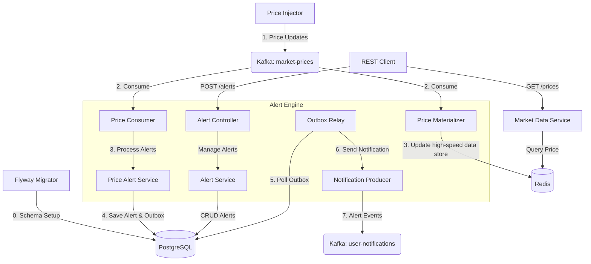

📈 Distributed Real-Time Stock Alert System
=========================================

A high-performance microservices ecosystem built with **Java 21**, **Micronaut 4**, and **Kafka**, demonstrating modern architectural patterns for reliability and scalability.

Overview
--------
The **Stock Alert System** allows users to set price alerts (e.g., "Notify me when TSLA goes above $400"). It solves the "Dual Write" problem (writing to a database and sending a message to Kafka) using the **Transactional Outbox Pattern**, ensuring data consistency even under failure.

Key Features
------------
*   **Transactional Outbox Pattern**: Guaranteed event delivery to Kafka without distributed transactions.
*   **High-Performance Concurrency**: Leveraging Java 21 Virtual Threads (Project Loom) for non-blocking I/O across all services.
*   **Idempotent Consumers**: Guaranteed processing of price updates exactly once, even with Kafka's at-least-once delivery.
*   **Real-Time Materialization**: Market prices are materialized from Kafka into Redis for sub-millisecond lookups.
*   **Observability**: Integrated with Micrometer, Prometheus, and Health Checks, events are tracked with Correlation ID.

Architecture
------------
The system consists of four main modules:

1.  **Price Injector**: A simulator that generates random market movements for stock symbols (TSLA, ORCL, AMZN) and broadcasts updates to the `market-prices` Kafka topic.
2.  **Alert Engine**: The core service that:
    *   Consumes price ticks from Kafka.
    *   Evaluates pending user alerts.
    *   Persists triggered alerts to PostgreSQL.
    *   Records events in an `outbox` table within the same transaction.
    *   Runs an **Outbox Relay** background worker to push events from the DB to Kafka.
    *   Database Migrations: Automatically manages PostgreSQL schema using Flyway (deployed as a K8s init container).
3.  **Market Data Service**: Provides a REST API to query the latest stock prices stored in Redis.
4.  **Common**: Shared DTOs, Enums, and Constants.

### Architecture Diagram



Tech Stack
----------
*   **Runtime**: Java 21 (Virtual Threads)
*   **Framework**: Micronaut 4.x
*   **Messaging**: Apache Kafka
*   **Persistence**: PostgreSQL (via Micronaut Data JDBC/JPA)
*   **Database Migrations**: Flyway
*   **High-Speed Data Store**: Redis (Lettuce driver)
*   **Build Tool**: Maven
*   **Testing**: JUnit 5, Mockito, Micronaut Test
*   **Deployment**: Docker Compose, Kubernetes, Minikube

Getting Started
---------------

### Prerequisites
*   Docker and Docker Compose
*   Java 21 (for local builds)
*   Maven

### Running with Docker Compose
1.  Clone the repository.
2.  Start the infrastructure (PostgreSQL, Redis, Kafka, Kafka Console):
    ```bash
    docker-compose up -d
    ```
3.  Access **Redpanda Console** at `http://localhost:8080` to monitor Kafka topics.

### Local Development
You can run the services individually. Ensure the infrastructure is running via Docker Compose first.

#### PostgreSQL Setup
For local development, the `alert-engine` expects a PostgreSQL database named `stock_alerts`. While Flyway handles this in Kubernetes, for local runs you should ensure the database is created and the schema is applied.

The SQL migration scripts can be found in `k8s/alert-engine-migrations-config.yaml` (as a Kubernetes ConfigMap).

*   **Build the project**: `mvn clean install`
*   **Run Alert Engine**: `mvn mn:run -pl alert-engine` (Port 8082)
*   **Run Price Injector**: `mvn mn:run -pl price-injector` (Port 8086)
*   **Run Market Data Service**: `mvn mn:run -pl market-data-service` (Port 8083)

### Deployment to Minikube
To deploy the system in a local Kubernetes cluster:

1.  **Prerequisites**: Ensure Minikube and `kubectl` are installed and running (`minikube start`).
2.  **Point Docker to Minikube**:
    ```bash
    eval $(minikube docker-env)
    ```
3.  **Build Docker Images**:
    ```bash
    docker build -t alert-engine:v1 ./alert-engine
    docker build -t price-injector:v1 ./price-injector
    docker build -t market-data-service:v1 ./market-data-service
    ```
4.  **Create Secrets**:
    ```bash
    kubectl create secret generic alert-engine-secret \
      --from-literal=JDBC_USER=<user> \
      --from-literal=JDBC_PASSWORD=<password>
    ```
5.  **Apply K8s Manifests**:
    ```bash
    kubectl apply -f k8s/
    ```
6.  **Access Services**:
    Use `minikube service` to expose the ports or access them via the Minikube IP.
    Alternatively, use port forwarding to access the APIs on your local machine:
    ```bash
    # For Alert Engine (Port 8082)
    kubectl port-forward service/alert-engine-service 8082:8082

    # For Market Data Service (Port 8083)
    kubectl port-forward service/market-data-service 8083:8083
    ```
    Note: The K8s setup is configured to connect to infrastructure services (Kafka, Postgres, Redis) running on the host machine via `host.minikube.internal`. Ensure Docker Compose is running.

Scaling
-------
The system is designed for horizontal scalability, specifically for the core processing and data retrieval components:

*   **Alert Engine**: Can be scaled to multiple pods.
    *   **Price Consumption**: Uses Kafka Consumer Groups (`alert-engine` and `price-materializer`), allowing Kafka to balance price updates across all available pods.
    *   **Outbox Relay**: High availability is achieved via optimistic locking in the database. Each pod uses its unique name (e.g., `alert-engine-xxxxx`) as an `INSTANCE_ID` to claim and process outbox events, preventing duplicates and ensuring reliable delivery even if a pod fails.
*   **Market Data Service**: A stateless REST API that can be scaled horizontally to handle high query volumes for the latest stock prices.
*   **Price Injector**: **Do not scale.** This is a simulator that generates a single stream of market movements.

To scale the services in Minikube:
```bash
kubectl scale deployment alert-engine --replicas=3
kubectl scale deployment market-data-service --replicas=3
```

API Documentation
-----------------
Each service provides **OpenAPI** (Swagger UI) for API exploration:
*   **Alert Engine**: `http://localhost:8082/v1/swagger-ui`
*   **Market Data Service**: `http://localhost:8083/v1/swagger-ui`

### Core Endpoints

| Service | Method | Endpoint                             | Description | Payload |
| :--- | :--- |:-------------------------------------| :--- | :--- |
| Alert Engine | `POST` | `/<version>/alerts`                  | Create a new price alert | `{"userId": "1", "symbol": "TSLA", "targetPrice": 400.0, "condition": "ABOVE"}` |
| Alert Engine | `GET` | `/<version>/alerts/history/{userId}` | Get triggered alert history | N/A |
| Market Data Service | `GET` | `/<version>/prices/{symbol}`         | Get latest stock price from Redis | N/A |

Monitoring & Observability
--------------------------
*   **Distributed Tracing**: Every event and price update is tracked with a **Correlation ID** (e.g., `eventId` from the `PriceUpdateDto`). This ID is propagated through the system via the **Mapped Diagnostic Context (MDC)** for consistent logging across microservices.
*   **Metrics**: Available at `/v1/management/prometheus` on each service port.
*   **Health Checks**: Found at `/v1/management/health`.
*   **Kafka Monitoring**: Use the **Redpanda Console** at `http://localhost:8080`.